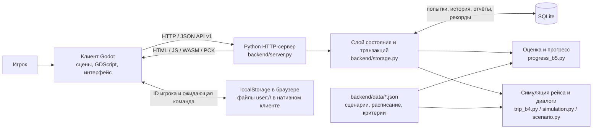
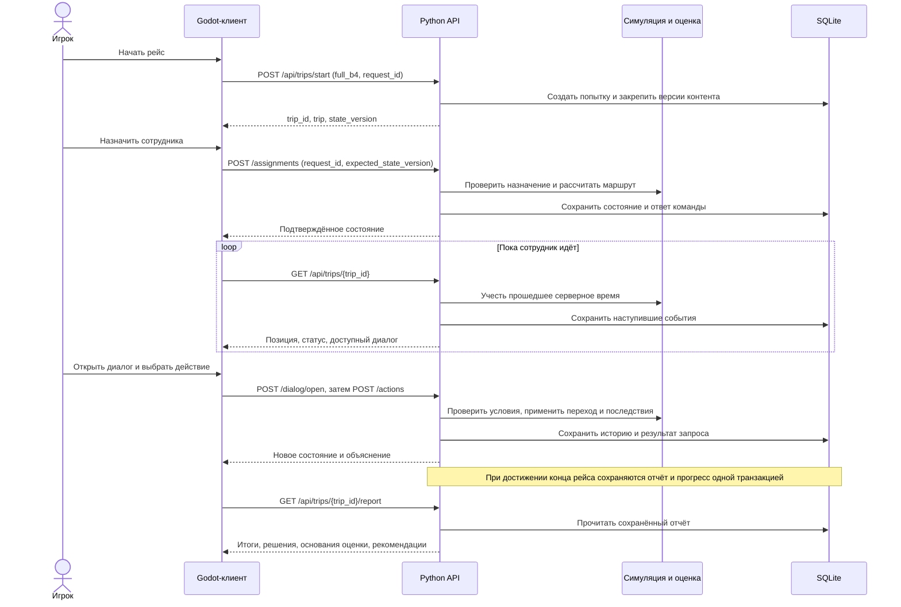
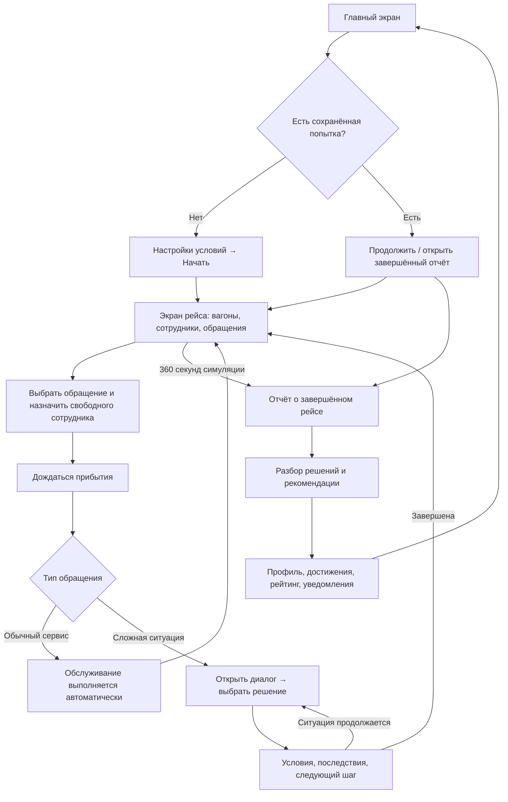

# Head of Train — «Начальник рейса»

Игровой тренажёр управления пассажирским рейсом: распределение задач между проводниками, решения в сложных ситуациях и разбор последствий.

- [Репозиторий](https://github.com/DekiruDeku/HeadOfTrain).
- [История коммитов](https://github.com/DekiruDeku/HeadOfTrain/commits/main/).
- Локальный прототип после запуска: [http://127.0.0.1:8765/](http://127.0.0.1:8765/). Публичная онлайн-версия не настроена.
- Отдельно: [архитектура](docs/ARCHITECTURE.md), [API](docs/API.md), [User Flow](docs/USER_FLOW.md), [развитие](docs/ROADMAP.md), [текст для заявки](docs/SUBMISSION.md).

## Локальное развёртывание

**Одной папки game недостаточно.** Нужны:

| Папка | Назначение |
|---|---|
| `game/` | Исходники Godot, ресурсы и start.cmd |
| `backend/` | Python-сервер, все модули, JSON в data и SQL в migrations |
| `build/web/` | Готовая игра: HTML, JS, WASM, PCK и вспомогательные файлы |
| `tools/` | Запуск, экспорт и совместимый шаблон сборки |
| `docs/` | Документация |

На момент подготовки документации опубликованная main содержит только клиент. Инструкция относится к **полной поставке**; сервер и сборку ещё нужно загрузить в репозиторий.

### Готовая игра

Нужны **Python 3.10+** и браузер с WebGL 2. Godot, Node.js и дополнительные Python-пакеты не нужны.

1. Распакуйте полный архив прототипа или скачайте репозиторий после публикации полной структуры.
2. На Windows дважды нажмите `game/start.cmd`.
3. После строки `Game:` откройте [http://127.0.0.1:8765/](http://127.0.0.1:8765/).
4. Оставьте окно сервера открытым. Остановка — Ctrl+C.

Ручной запуск из корня полной поставки:

```powershell
python backend/server.py --host 127.0.0.1 --port 8765
```

На Windows можно использовать `py -3` вместо `python`. На macOS/Linux — `python3`; текущие проверки выполнялись на Windows, совместимость со всеми браузерами не заявляется.

[Проверка сервера](http://127.0.0.1:8765/api/health) возвращает `ok: true`, `service: "head-of-train"`, `api_version: "v1"`.

| Проблема | Решение |
|---|---|
| Health работает, главная страница — 404 | Добавить build/web или выполнить экспорт ниже |
| Игра открыта как файл | Использовать адрес сервера, а не file:// |
| Порт занят | Запустить `python backend/server.py --port 9000`, открыть http://127.0.0.1:9000/ |
| Видна старая версия | Пересобрать Web и нажать Ctrl+F5; start.cmd не выполняет сборку |
| Потеря связи | Проверить сервер и нажать «Восстановить связь» |
| Нет Python | Установить Python с добавлением в PATH, открыть новый терминал |

### Сохранения

База `backend/var/head-of-train.sqlite3` создаётся автоматически. Для чистой демонстрации используйте **новый** путь:

```powershell
python backend/server.py --db demo-data/new-game.sqlite3
```

Не запускайте два сервера на одном порту. Для доступа к прежнему прогрессу нужны прежняя база и ID игрока: используйте тот же адрес, порт и профиль браузера. Нативный клиент и браузер имеют разные ID.

Резервная копия работающей базы:

```powershell
python backend/database.py backup --source backend/var/head-of-train.sqlite3 --destination backups/snapshot.sqlite3
```

Назначение должно быть новым. Запуск копии: `python backend/server.py --db backups/snapshot.sqlite3`. Сохраните также ID игрока. Копирование одного файла работающей WAL-базы не заменяет SQLite backup API.

### Исходники и повторная сборка

Установите **Godot 4.7.2 Standard / Compatibility**, запустите Python-сервер, импортируйте `game/project.godot` и нажмите **F5**. Нативный API — http://127.0.0.1:8765 или переменная `HEAD_OF_TRAIN_API`, заданная до запуска Godot.

Экспорт из корня проекта:

```powershell
python tools/export_web.py --godot "C:\Tools\Godot\Godot_v4.7.2-stable_win64_console.exe"
```

Замените путь на свой. Версия закреплена скриптом и комплектным `tools/export_templates/web_nothreads_release.zip`. Скрипт устанавливает шаблон, импортирует game и создаёт build/web. Для macOS/Linux используйте python3 и соответствующий путь к Godot. Возможны также GODOT_EXE или godot в PATH. Экспорт без потоков, PWA выключена.

## Реализованный объём

Один рейс, два вагона, три проводника, три разветвлённых сценария и два сервисных обращения. Работают движение сотрудников, диалоги, последствия, сроки реакции, пауза, ускорение, отчёт, профиль, рекорды, достижения, рейтинг и уведомления. Третий вагон — будущий контент.

## Архитектура решения

Head of Train — клиент-серверный тренажёр. Клиент на **Godot 4.7.2 / GDScript** показывает поезд, сотрудников, обращения, диалоги и результаты. **Python 3.10+** обрабатывает HTTP API и раздаёт Web-сборку с того же адреса. Состояние хранится в **SQLite**; сценарии задаются JSON-файлами. Сервер использует стандартную библиотеку Python, отдельная СУБД и установка пакетов через pip не нужны.

### Диаграмма компонентов



| Компонент | Ответственность |
|---|---|
| `game/main.gd`, `game/scenes/`, `game/scripts/` | Навигация, отображение, выбор обращения и сотрудника, диалоги, отчёт, профиль и рейтинг |
| `session_api.gd`, `progress_api.gd`, `crew_state.gd` | Запросы к API, восстановление сессии, повтор неподтверждённой команды, подготовка состояния для интерфейса |
| `backend/server.py` | Маршруты, JSON, идентификатор игрока, статические файлы `build/web/` |
| `backend/storage.py` | Проверка владельца попытки и версии состояния, транзакции, защита от повторного применения команд |
| `backend/trip_b4.py` | Полный рейс: расписание, движение сотрудников, обслуживание, диалоги, сроки и завершение |
| `backend/simulation.py`, `backend/scenario.py` | Общие механизмы симуляции и поддержка прежних режимов |
| `backend/progress_b5.py` | Оценка решений, личные рекорды, компетенции, достижения и открытие будущего контента |
| `backend/data/`, `backend/migrations/` | Версионируемый контент и создание схемы SQLite |
| `build/web/`, `tools/` | Готовая браузерная игра, запуск и повторный экспорт |

### Диаграмма последовательности: решение обращения



Сервер — источник истины для времени, доступности решений и очков. Клиент анимирует последнее подтверждённое состояние. Симуляция пересчитывается при обращениях к API по прошедшему серверному времени; отдельного фонового планировщика нет.

Каждая изменяющая команда получает `request_id`. Повтор идентичной команды возвращает сохранённый ответ и не применяет её второй раз. `expected_state_version` защищает от действий по устаревшему состоянию. После потери связи клиент повторяет неподтверждённую команду с прежним ID и телом, затем получает актуальное состояние.

В SQLite сохраняются попытки с закреплёнными сценариями, история решений, отчёты, результаты запросов и прогресс. Браузер хранит ID и данные восстановления, а не самостоятельную копию серверной базы. Для доступа к прежнему прогрессу нужны и база, и прежний ID игрока.

## Описание API

**Формат:** HTTP + JSON UTF-8, версия `v1`. Локальный адрес: `http://127.0.0.1:8765`. Полная Markdown-документация с телами запросов, полями ответа, ошибками и исполняемым примером: [docs/API.md](docs/API.md).

Для игровых запросов клиент передаёт `X-Demo-Player`: 32 строчных шестнадцатеричных символа. Также поддерживается cookie `hot_demo_player`; заголовок имеет приоритет. Это идентификатор демо-игрока, не полноценная авторизация. `GET /api/health` доступен без него.

| Метод | Маршрут | Назначение |
|---|---|---|
| GET | `/api/health` | Проверка доступности сервера |
| POST | `/api/trips/start` | Создать или восстановить попытку; для полного рейса передать `simulation_mode: "full_b4"` |
| GET | `/api/trips/current` | Текущая попытка игрока |
| GET | `/api/trips/{trip_id}` | Состояние конкретной попытки |
| POST | `/api/trips/{trip_id}/assignments` | Назначить сотрудника на обращение |
| POST | `/api/trips/{trip_id}/dialog/open` | Открыть доступный диалог |
| POST | `/api/trips/{trip_id}/dialog/close` | Закрыть диалог |
| POST | `/api/trips/{trip_id}/actions` | Применить выбранное действие |
| POST | `/api/trips/{trip_id}/time` | Пауза / скорость симуляции: `speed=0,1,2,4` |
| GET | `/api/trips/{trip_id}/report` | Сохранённый отчёт завершённого рейса |
| POST | `/api/trips/{trip_id}/complete` | Подтвердить уже завершённый рейс; не завершает его досрочно |
| GET | `/api/profile` | Очки, компетенции, рекорды, достижения, ссылки на отчёты |
| GET | `/api/leaderboard?scope=crew&page=1&page_size=10` | Рейтинг бригады, депо или компании |
| GET | `/api/notifications?page=1&page_size=10` | Сохранённая лента уведомлений |

Все изменяющие запросы обычного клиента содержат уникальный `request_id`. Назначение, открытие/закрытие диалога, решение и управление временем также требуют `expected_state_version` из последнего состояния. Очки и произвольное прошедшее время клиент не передаёт. Повтор команды после потери ответа должен сохранять ID и исходное тело.

Пример начала полного рейса в PowerShell при запущенном сервере:

```powershell
$hotHeaders = @{ "X-Demo-Player" = [guid]::NewGuid().ToString("N") }
$hotBody = @{
    request_id = [guid]::NewGuid().ToString("N")
    simulation_mode = "full_b4"
    luggage_space = "free"
} | ConvertTo-Json
$hotReply = Invoke-RestMethod -Method Post -Uri "http://127.0.0.1:8765/api/trips/start" -Headers $hotHeaders -ContentType "application/json" -Body $hotBody
$hotReply.trip
```

Успех содержит `ok: true` и `api_version: "v1"`; ошибка — `ok: false`, `error`, `message`. Например, 409 `state_version_conflict` означает необходимость прочитать новое состояние перед новым выбором, а 422 `action_unavailable` — недоступность решения при текущих условиях.

## Пользовательский сценарий — User Flow



### Пошаговая демонстрация

1. Откройте игру. В настройках можно выбрать свободное или занятое место для багажа. Для первого прохождения оставьте свободное и нажмите «Начать».
2. На экране рейса назначьте Анну на просьбу о пледе, затем Веру на чемодан в проходе. Вера находится у этого обращения; диалог доступен после подтверждённого прибытия.
3. Откройте диалог о багаже: объясните необходимость свободного прохода, проверьте место вместе с владельцем, предложите размещение и подтвердите свободный проход.
4. На 100-й секунде симуляции появится жалоба на детей. Назначьте Анну; выслушайте обе стороны, проверьте возможность пересадки и затем проверьте договорённость.
5. На 200-й секунде назначьте Бориса убрать столик. После его прибытия обслуживание выполняется автоматически.
6. На 260-й секунде назначьте Бориса на спор о месте. Проверьте билеты, помогите найти правильное место, убедитесь в результате.
7. На 360-й секунде рейс завершается. Откройте отчёт, историю решений, нарушения и основания оценки. Затем посмотрите профиль, достижения, рейтинг и уведомления.
8. Обновите страницу: игра восстановит попытку либо завершённый отчёт. Для новой попытки используйте соответствующее действие в игре после окончания текущей.

Список обращений может занимать несколько страниц. Плед и уборка не требуют диалоговых решений. Необходимо успеть **прибыть** до срока реакции: одного назначения недостаточно.

### Время и управление

- Рейс длится **360 секунд симуляции**. Реальное время зависит от чтения диалогов, пауз и выбранной скорости; это не обещание ровно шестиминутного прохождения.
- Вне диалога доступны пауза и скорости ×1, ×2, ×4. Клавиши: **Пробел**, **1**, **2**, **4**; также есть кнопки на экране.
- Открытый диалог приостанавливает движение, расписание и остальные обращения. Критический таймер текущего диалога продолжает идти с обычной скоростью, даже если до открытия была ручная пауза.
- В диалоге нельзя менять скорость. Для багажа начальное решение ограничено 45 секундами, проверка результата — 30 секундами.
- Закрытие диалога само по себе не сбрасывает критический таймер: далее действует выбранная скорость рейса. Переключение вкладки браузера не включает паузу.

### Примеры игровых сценариев

| Ситуация | Условия и действия | Результат в прототипе |
|---|---|---|
| Чемодан в проходе | Место свободно: проверить условия → помочь разместить → проверить проход | Проблема устранена; история фиксирует проверку условий и безопасности |
| Чемодан, место занято | Проверить условия → выбрать альтернативное размещение → проверить проход | Решение зависит от условий; обычное размещение недоступно |
| Разрешить оставить чемодан | Выбрать разрешение оставить багаж в проходе | Лояльность владельца +4, безопасность −20, критическая отметка и объяснение в разборе |
| Не успеть с критическим решением | Дождаться истечения таймера в диалоге о багаже | Автоматическое последствие и запись о просрочке |
| Пассажиру мешают дети | Выслушать обе стороны → проверить пересадку → предложить доступный вариант → проверить договорённость | Оцениваются проверка условий и подтверждение результата; учитываются обе стороны |
| Пассажир не на своём месте | Проверить билеты → учесть причину → помочь занять место → проверить результат | Различаются ошибка пассажира и намеренная пересадка |
| Просьба о пледе | Анна прибывает до срока; обслуживание занимает 20 секунд симуляции | Лояльность +8; при пропуске обращения −8 |
| Уборка столика | Борис прибывает до срока; обслуживание занимает 15 секунд симуляции | Лояльность +6; при пропуске обращения −6 |

Расписание появления: багаж и плед — 0 с, дети — 100 с, столик — 200 с, спор о месте — 260 с. Сроки реакции: соответственно 75, 90, 90, 100 и 90 секунд с момента появления.

Через API доступны дополнительные условия: `relocation=available|unavailable` и `seat_reason=mistake|intentional`. Их наличие в API не означает наличие отдельных переключателей в текущем меню.

Максимальная оценка рейса — **170 очков**: коммуникация — 50, безопасность — 20, приоритизация — 100. Профиль суммирует лучшие результаты отдельных сценариев; повторное прохождение добавляет только улучшение рекорда. Достижения не дают дополнительных очков. Все учебные формулировки и веса пока демонстрационные.

## Ограничения и развитие после хакатона

### Текущие ограничения

- **Объём контента:** один рейс, два игровых вагона, три проводника, три разветвлённых сценария и два сервисных обращения. Вагон № 3 может появляться в прогрессе как будущий контент, но игрового рейса для него нет.
- **Учебная достоверность:** сценарии имеют статус `draft` / `unverified_missing_dataset`. Исходный нормативный датасет не предоставлен; реплики, допустимость действий и веса оценки требуют проверки специалистами. Прототип не является системой аттестации.
- **Баланс:** расписание фиксировано, а не генерируется процедурно. Сложность и длительность прохождения новым пользователем ещё требуют исследования.
- **Идентификация:** `X-Demo-Player` — демонстрационный идентификатор, полноценной регистрации, проверки личности и ролевого доступа нет. Организационная принадлежность в рейтинге демонстрационная.
- **Эксплуатация:** Python HTTP-сервер и SQLite рассчитаны на локальную демонстрацию. Промышленная нагрузка, отказоустойчивость и публичное размещение не подтверждены.
- **Сессии:** предполагается одна активная вкладка игры. Нет синхронизации очереди команд между вкладками, переноса аккаунта между устройствами и полностью автономного браузерного режима без backend.
- **Время:** события рассчитываются при запросах к серверу; фонового исполнителя нет. Даже после закрытия страницы прошедшее время будет учтено при следующем запросе, если рейс не был поставлен на паузу.
- **Совместимость:** наличие Web-сборки не подтверждает работу на всех браузерах и мобильных устройствах. Исторические проверки находятся в `docs/qa/`; новый полный обзор интерфейса и тестирование на физических телефонах в рамках подготовки документации не проводились.
- **Раздача прототипа:** статического хостинга одного Godot-клиента недостаточно, ему нужен Python API. Отдельная публичная игровая площадка в поставке не настроена.

### Предлагаемый план развития

Это план следующих этапов, а не перечень уже реализованных функций. Сроки определяются после пилота и оценки команды.

| Этап | Сценарии и механики | Ожидаемый результат / критерий готовности |
|---|---|---|
| 1. Проверка учебного содержания | Совместно с экспертами проверить существующие диалоги, последствия и критерии; привязать решения к актуальным учебным материалам | Для каждого допустимого и ошибочного действия есть проверенное объяснение и источник |
| 2. Пилот и настройка сложности | Проверить понятность управления на новых игроках, длительность чтения, сроки реакции, оценивание; добавить вводное обучение и настройки доступности | Игрок проходит вводный рейс без помощи разработчика; собираются измеримые результаты пилота |
| 3. Новые ситуации и вариативность | Развить багаж, шум и спор о месте; добавить согласованные сценарии опоздания, утраченной вещи, помощи маломобильному пассажиру и групповой посадки; менять условия и последовательность | Повторный рейс требует анализа условий, а не воспроизведения запомненных ответов |
| 4. Управление бригадой | Навыки и усталость сотрудников, загрузка, приоритеты, очереди задач, передача обращения, ограниченные ресурсы | Выбор сотрудника и порядок задач ощутимо влияют на сервис, безопасность и время |
| 5. Кампания и персональная тренировка | Третий вагон и новые рейсы, уровни сложности, подбор упражнений по ошибкам, сравнение попыток и расширенный разбор | Новые рейсы реально доступны; рекомендации ведут к конкретным тренировочным ситуациям |
| 6. Инструменты методиста | Редактор графов сценариев с проверкой связности, версионирование и согласование контента, аналитика группы, экспорт результатов | Методист добавляет и проверяет сценарий без изменения кода симуляции |
| 7. Подготовка к внедрению | Авторизация и роли, управляемые группы, публичное развёртывание с HTTPS, мониторинг, резервное копирование и нагрузочные проверки; при необходимости перенос хранения на серверную СУБД | Воспроизводимый выпуск и восстановление; подтверждённые требования к безопасности и нагрузке |

Приоритет после хакатона: сначала проверить учебное содержание и провести пилот, затем расширять игровые механики и кампанию.

## Проверки и публикация

При подготовке документации на Windows / Python 3.11.9 прошли **140 серверных тестов**:

```powershell
python -m unittest discover -s backend/tests -q
```

Набор включает сценарии, время, сохранения, восстановление, повторные команды, конкуренцию и прогресс. Полная повторная визуальная проверка в рамках документации не проводилась.

.gitignore разрешает build/web и исключает рабочие базы и кэши. История Git сохраняется; новые коммиты должны описывать реальные изменения. Локальные файлы ещё не отправлены на GitHub.

**В рабочей папке game есть отдельная .git.** Не добавляйте её во внешний репозиторий вслепую: Git может записать ссылку на вложенный репозиторий вместо файлов. [Порядок публикации](docs/PUBLICATION.md).
